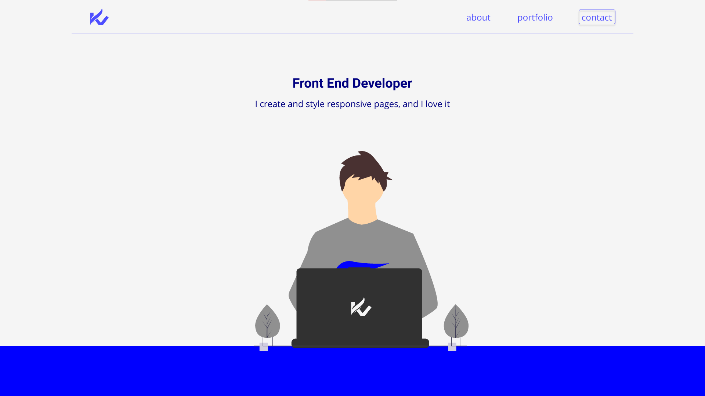

   

  
  
  

   

---

## :pushpin: Sobre

Meu portfolio :)

#### Acesse os templates no Figma:

- [Layout Web - Figma](https://www.figma.com/proto/GaWrskdfgs1vCu9sSKPLQD/Layout-portfolio?node-id=55%3A38&scaling=min-zoom&page-id=0%3A1)

## ✨ Tecnologias utilizadas

Este projeto foi desenvolvido utilizando as seguintes tecnologias:

- [ReactJS](https://reactjs.org/)
- [Typescript](https://www.typescriptlang.org/)

## 📝 Licença

Este projeto está sob a licença MIT. Veja o arquivo [LICENSE](LICENSE) para mais detalhes.

---

Made with 💻 by <a href="https://github.com/kistvictor">Victor Kist</a>   

